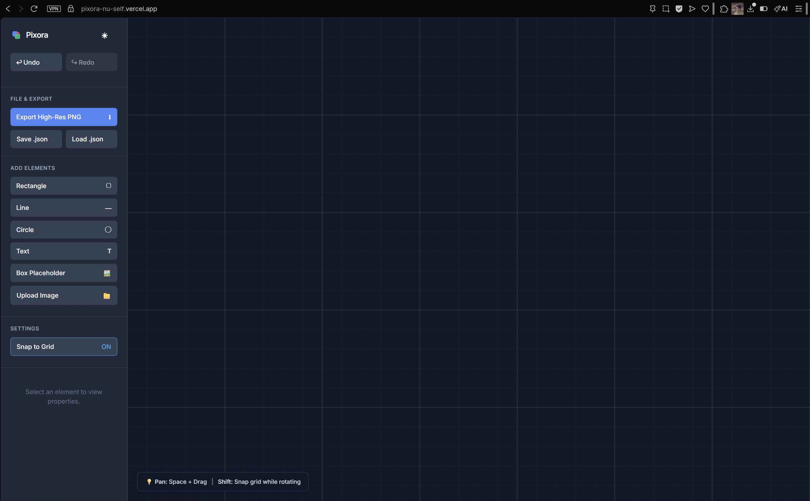
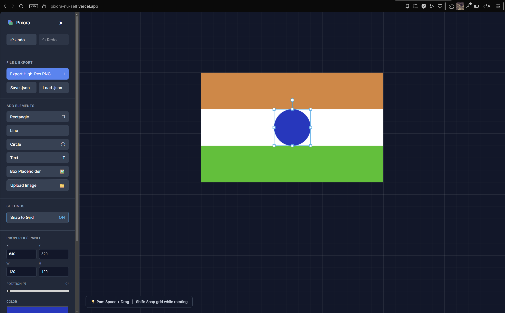
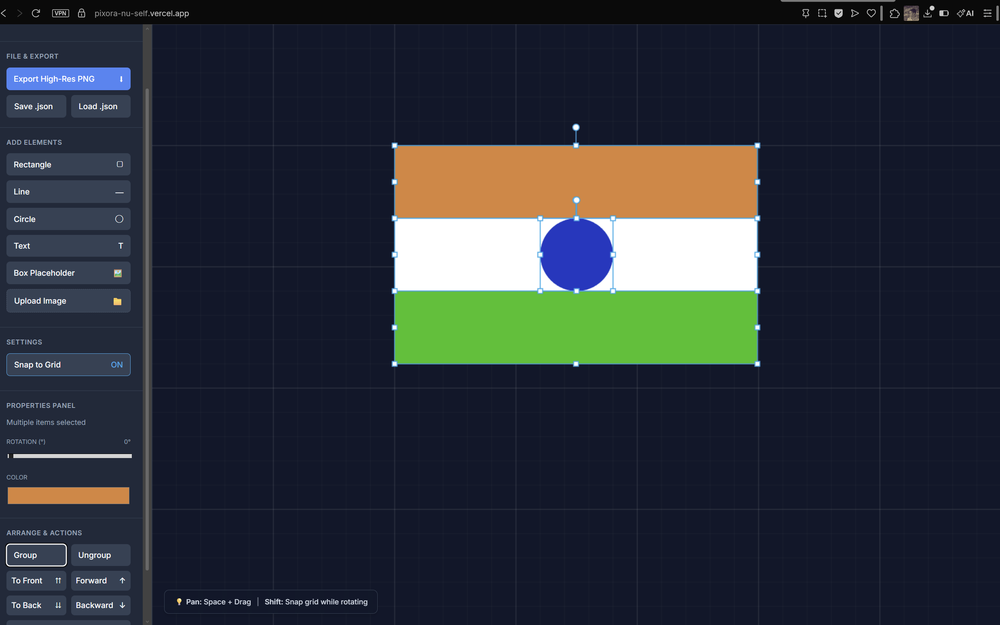

# 🎨 Pixora

**Pixora** is a high-performance, browser-based vector design engine built from the ground up using **React 18** and the **HTML5 Canvas API**. It uses a custom-coded mathematical engine to handle object transformations, grouping, and intelligent layering.

---

## 📸 Project Gallery

| | |
| :--- | :--- |
|  |  |
| **01. Workspace Overview** Clean, responsive Dark Mode UI featuring an infinite grid and intuitive toolbars. | **02. Vector Composition** The Indian Flag built using coordinate-perfect shapes and hex-accurate color values. |
|  |  |
| **03. Precision Selection** Proof of the object-level data binding, showing the properties for the Ashoka Chakra. | **04. Smart Grouping** The entire flag bound into a single logical entity using the `Ctrl+G` stitching logic. |

---

## 🚀 Technical Highlights

* **Custom Math Engine:** Implements coordinate geometry for $15^\circ$ rotation snapping and perfect $1:1$ aspect ratio locking.
* **Collision-Aware Layering:** A Z-index management system that allows elements or groups to "jump" over or under overlapping elements.
* **Object Stitching (Grouping):** Enables multiple independent vector paths to be bound into a single logical entity for unified transformation.
* **Non-Destructive Editing:** Full Undo/Redo history stack implemented via state-serialization.
* **High-Res Rasterization:** Custom export logic that calculates the bounding box of canvas elements to generate a 2x scaled PNG.

---

## ⌨️ Power-User Shortcuts

| Shortcut | Action |
| :--- | :--- |
| **Ctrl + G** | Group selected elements |
| **Shift + Drag** | Snap rotation ($15^\circ$) or Lock Aspect Ratio |
| **Ctrl + D** | Duplicate selection |
| **Ctrl + Z / Y** | Undo / Redo |
| **Del / Backspace** | Delete selection |
| **Space + Drag** | Pan the canvas |

---

## 🛠️ Tech Stack

* **Framework:** React 18
* **Rendering:** HTML5 Canvas API
* **Build Tool:** Vite
* **Deployment:** Vercel

---
**Developed by Hemant Raghav K R**